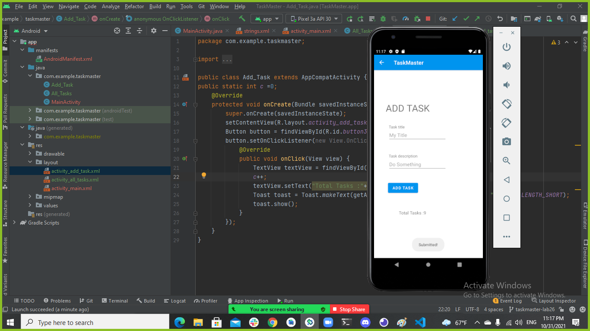
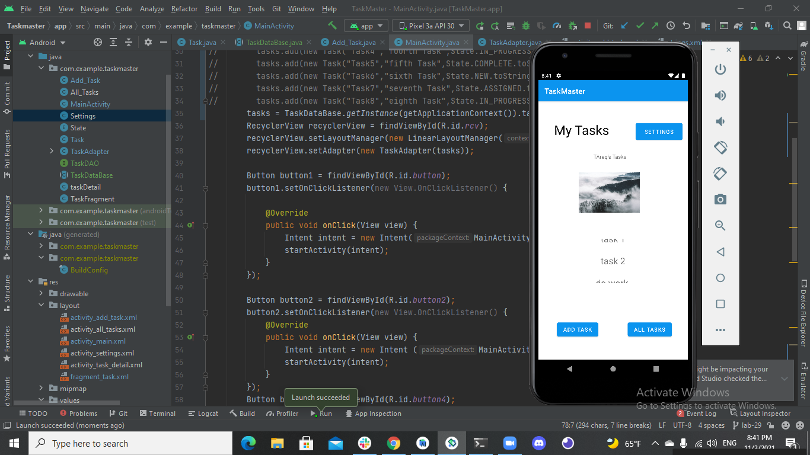
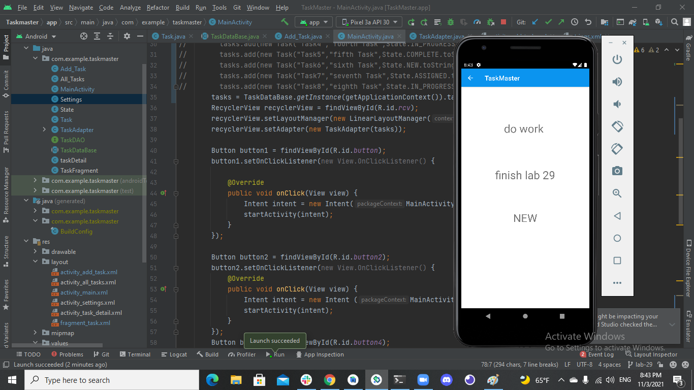
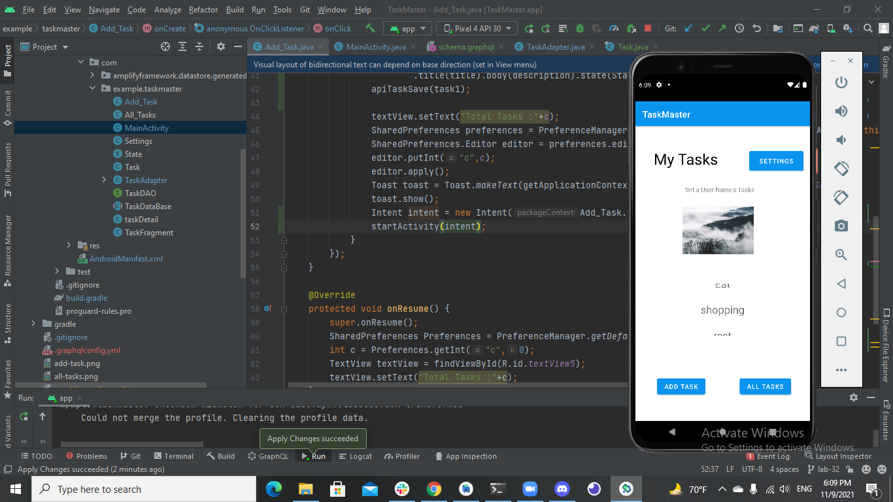
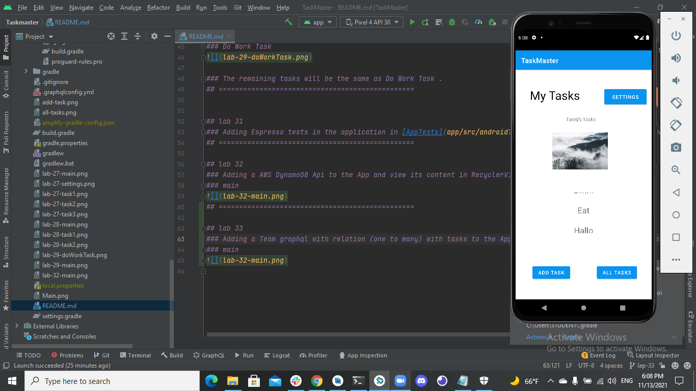

# Taskmaster
## lab 26
### Creating main page , Creating add task page and creating all tasks page.
### main

### add task

### alltasks

## ================================================

## lab 27 
### Adding Setting button in main page , Creating setting page and creating task details page.
### main 

### Settings

### task1

### task2

### task3

## ================================================

## lab 28 
### Adding RecyclerViews in main page.
### main 

### When click on one of the tasks in the RecyclerViews , it will redirect you to task details with the task data.
### task1

### task2

### The remaining tasks will be the same as task1 and task2. 
## ================================================

## lab 29 
### Adding a database and view its content int the RecyclerViews in main page .
### main 

### When click on one of the tasks in the RecyclerViews , it will redirect you to task details with the task data.
### Do Work Task

### The remaining tasks will be the same as Do Work Task . 
## ================================================

## lab 31
### Adding Espresso tests in the application in [AppTests](app/src/androidTest/java/com/example/taskmaster/HomePageTests.java) 
## ================================================

## lab 32
### Adding a AWS DynamoDB Api to the App and view its content in RecyclerViews in main page .
### main

## ================================================

## lab 33
### Adding a Team graphql with relation (one to many) with tasks to the App and view tasks depending on the chosen team in RecyclerViews in main page .
### main

 