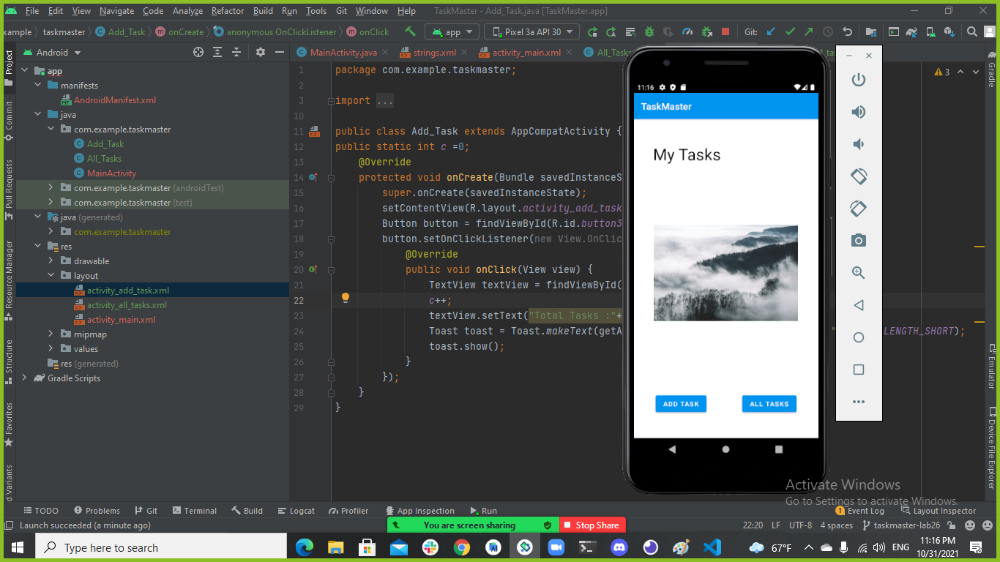
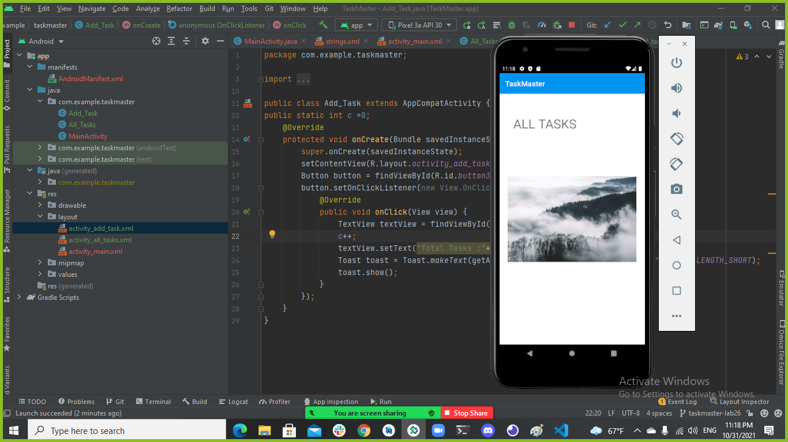
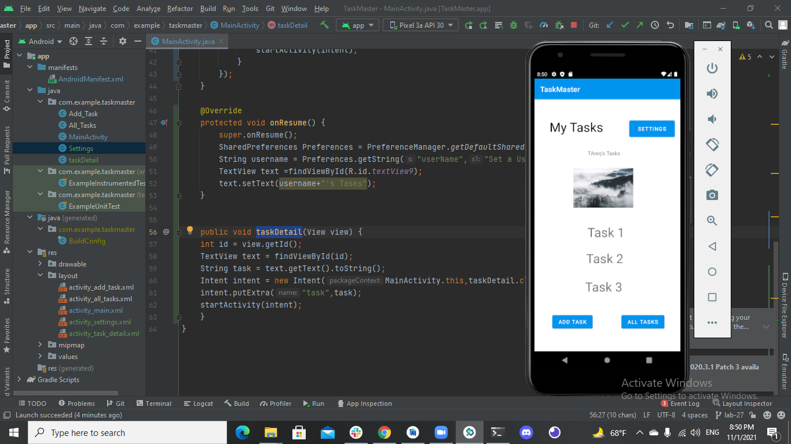
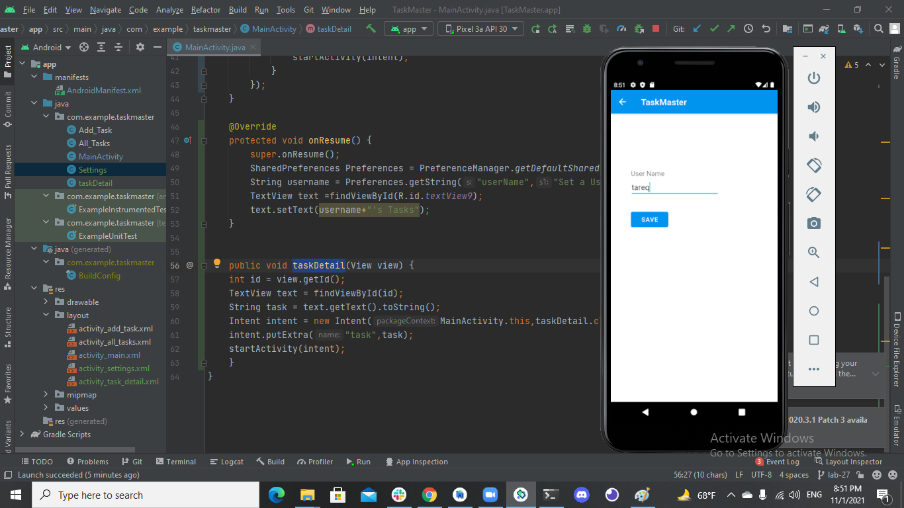
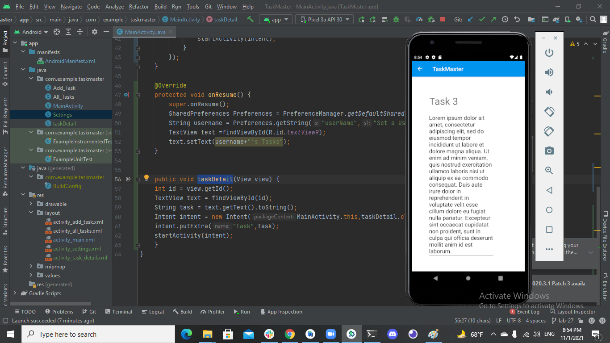
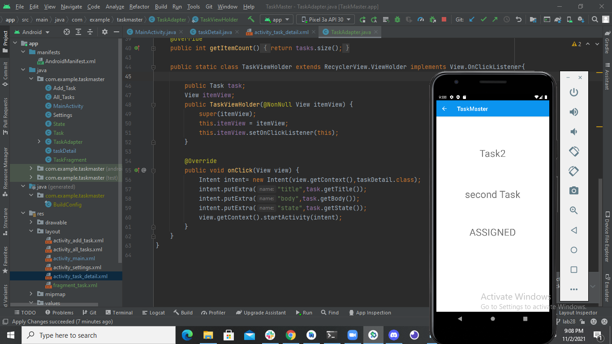

# Taskmaster
## lab 26
### Creating main page , Creating add task page and creating all tasks page.
### main

### add task

### alltasks

## ================================================

## lab 27 
### Adding Setting button in main page , Creating setting page and creating task details page.
### main 

### Settings

### task1

### task2

### task3

## ================================================

## lab 28 
### Adding RecyclerViews in main page.
### main 

### When click on one of the tasks in the RecyclerViews , it will redirect you to task details with the task data.
### task1

### task2

### The remaining tasks will be the same as task1 and task2. 

 